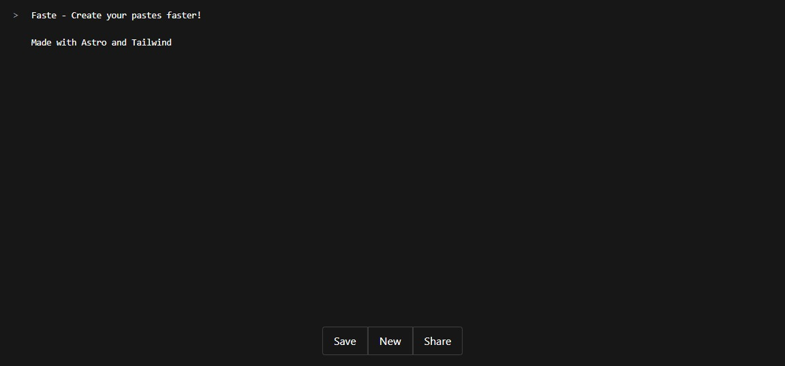

# Faste - Create your pastes faster



This project was made with [Bun](https://bun.sh/), but any other package manager should work.

## 💻 Getting started

To initialize the project, [fork](https://github.com/ticua07/faste/fork) or clone the project using:
```sh
git clone git@github.com:ticua07/faste.git
``` 

And install the dependencies
```sh
# recommended
bun install
# npm install
# yarn install
# pnpm install
```

Then start the dev server using 
```sh
bun run dev
# npm run dev
# yarn run dev
# pnpm run dev
```

For other commands, check [🧞 Commands](#🧞-commands)

## 🚀 Project Structure

Inside of this Astro project, you'll see the following folders and files:

```text
/
├── public/
│   └── icon.png
├── src/
│   ├── layouts/
│   │   └── Layout.astro
│   └── pages/
└── package.json
```

Any static assets, like images, are placed in the `public/` directory.

## 🧞 Commands

All commands are run from the root of the project, from a terminal:

| Command                   | Action                                           |
| :------------------------ | :----------------------------------------------- |
| `bun install`             | Installs dependencies                            |
| `bun run dev`             | Starts local dev server at `localhost:4321`      |
| `bun run build`           | Build your production site to `./dist/`          |
| `bun run preview`         | Preview your build locally, before deploying     |
| `bun run astro ...`       | Run CLI commands like `astro add`, `astro check` |
| `bun run astro -- --help` | Get help using the Astro CLI                     |
